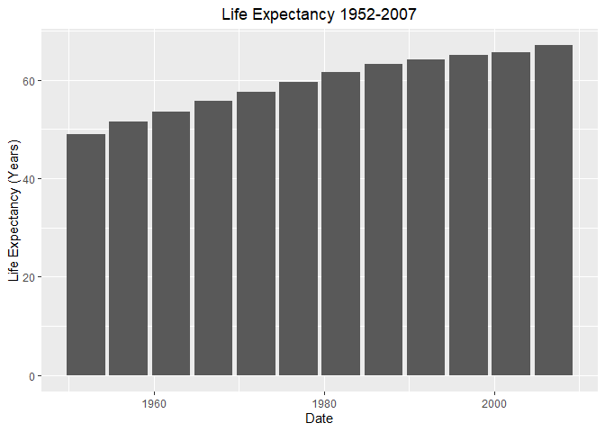
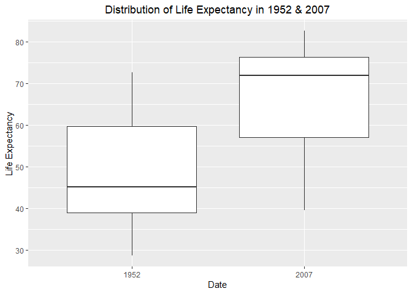
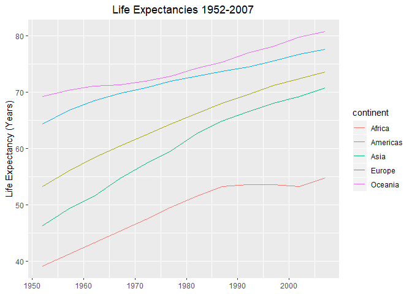
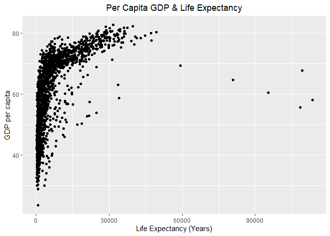
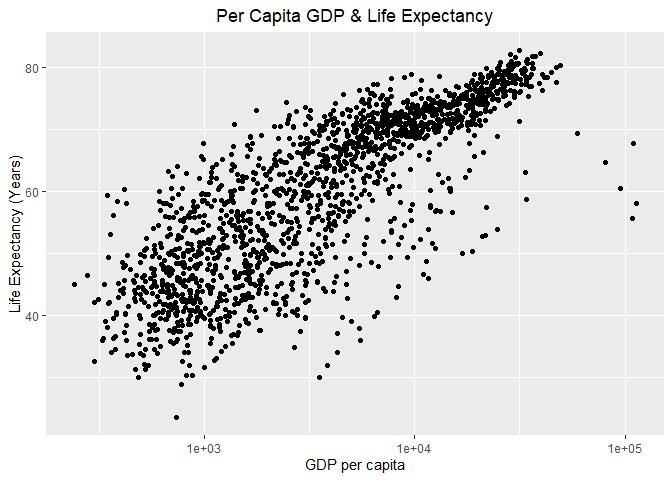
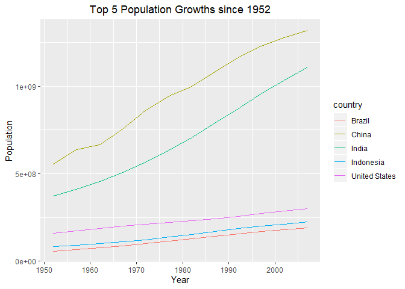
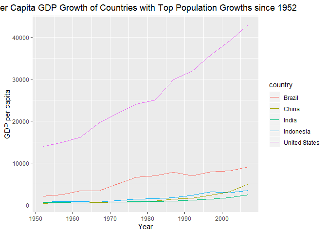

## Instructions
Answer the following questions and complete the exercises in RMarkdown. Please embed all of your code and push your final work to your repository. Your final lab report should be organized, clean, and run free from errors. Remember, you must remove the `#` for any included code chunks to run.  

## Libraries

```r
library(tidyverse)
```

## Resources
The idea for this assignment came from [Rebecca Barter's](http://www.rebeccabarter.com/blog/2017-11-17-ggplot2_tutorial/) ggplot tutorial so if you get stuck this is a good place to have a look.  

## Gapminder
For this assignment, we are going to use the dataset [gapminder](https://cran.r-project.org/web/packages/gapminder/index.html). Gapminder includes information about economics, population, and life expectancy from countries all over the world. You will need to install it before use. This is the same data that we used for the practice midterm. You may want to load that assignment for reference.  

```r
#install.packages("gapminder")
library("gapminder")
```

## Questions
The questions below are open-ended and have many possible solutions. Your approach should, where appropriate, include numerical summaries and visuals. Be creative; assume you are building an analysis that you would ultimately present to an audience of stakeholders. Feel free to try out different `geoms` if they more clearly present your results.  

**1. Use the function(s) of your choice to get an idea of the overall structure of the data frame, including its dimensions, column names, variable classes, etc. As part of this, determine how NAs are treated in the data.**  
There seems to be no NAs in this data, data was pre-tidied.

```r
str(gapminder)
```

```
## Classes 'tbl_df', 'tbl' and 'data.frame':	1704 obs. of  6 variables:
##  $ country  : Factor w/ 142 levels "Afghanistan",..: 1 1 1 1 1 1 1 1 1 1 ...
##  $ continent: Factor w/ 5 levels "Africa","Americas",..: 3 3 3 3 3 3 3 3 3 3 ...
##  $ year     : int  1952 1957 1962 1967 1972 1977 1982 1987 1992 1997 ...
##  $ lifeExp  : num  28.8 30.3 32 34 36.1 ...
##  $ pop      : int  8425333 9240934 10267083 11537966 13079460 14880372 12881816 13867957 16317921 22227415 ...
##  $ gdpPercap: num  779 821 853 836 740 ...
```

```r
names(gapminder)
```

```
## [1] "country"   "continent" "year"      "lifeExp"   "pop"       "gdpPercap"
```

```r
dim(gapminder)
```

```
## [1] 1704    6
```

```r
naniar::miss_var_summary(gapminder)
```

```
## # A tibble: 6 x 3
##   variable  n_miss pct_miss
##   <chr>      <int>    <dbl>
## 1 country        0        0
## 2 continent      0        0
## 3 year           0        0
## 4 lifeExp        0        0
## 5 pop            0        0
## 6 gdpPercap      0        0
```

```r
gapminder %>% 
  count(year)
```

```
## # A tibble: 12 x 2
##     year     n
##    <int> <int>
##  1  1952   142
##  2  1957   142
##  3  1962   142
##  4  1967   142
##  5  1972   142
##  6  1977   142
##  7  1982   142
##  8  1987   142
##  9  1992   142
## 10  1997   142
## 11  2002   142
## 12  2007   142
```


**2. Among the interesting variables in gapminder is life expectancy. How has global life expectancy changed between 1952 and 2007?**

```r
gapminder %>% 
  group_by(year) %>% 
  summarize(life_exp = mean(lifeExp)) %>% 
  ggplot(aes(x = year, y = life_exp))+
  geom_bar(stat = "identity")+
  labs(title = "Life Expectancy 1952-2007",
       x = "Date",
       y = "Life Expectancy (Years)")+
  theme(plot.title = element_text(hjust = 0.5))
```

<!-- -->


**3. How do the distributions of life expectancy compare for the years 1952 and 2007? _Challenge: Can you put both distributions on a single plot?_**

```r
gapminder %>% 
  mutate_at(vars(year), as.factor) %>% 
  filter(year == "1952" | year ==  "2007") %>% 
  ggplot(aes(x=year, y=lifeExp, group = year))+
  geom_boxplot()+
  labs(title = "Distribution of Life Expectancy in 1952 & 2007",
       x = "Date",
       y = "Life Expectancy")+
  theme(plot.title = element_text(hjust = 0.5))
```

<!-- -->


**4. Your answer above doesn't tell the whole story since life expectancy varies by region. Make a summary that shows the min, mean, and max life expectancy by continent for all years represented in the data.**

```r
gapminder %>% 
  group_by(continent) %>% 
  summarize(min_LE = min(lifeExp),
            mean_LE = mean(lifeExp),
            max_LE = max(lifeExp))
```

```
## # A tibble: 5 x 4
##   continent min_LE mean_LE max_LE
##   <fct>      <dbl>   <dbl>  <dbl>
## 1 Africa      23.6    48.9   76.4
## 2 Americas    37.6    64.7   80.7
## 3 Asia        28.8    60.1   82.6
## 4 Europe      43.6    71.9   81.8
## 5 Oceania     69.1    74.3   81.2
```


**5. How has life expectancy changed between 1952-2007 for each continent? Try using `geom_line()` for this, including all continents on the same  plot.**

```r
gapminder %>% 
  group_by(continent, year) %>% 
  summarize(mean_LE = mean(lifeExp)) %>% 
  ggplot(aes(x=year, y=mean_LE, group = continent, color = continent))+
  geom_line()+
  labs(group = "Continent",
       title = "Life Expectancies 1952-2007",
       y = "Life Expectancy (Years)",
       x = NULL)+
  theme(plot.title = element_text(hjust = 0.5))
```

<!-- -->


**6. We are interested in the relationship between per capita GDP and life expectancy; i.e. does having more money help you live longer?**

```r
gapminder %>% 
  ggplot(aes(x=gdpPercap, y=lifeExp))+
  geom_point()+
  labs(title = "Per Capita GDP & Life Expectancy",
       x = "Life Expectancy (Years)",
       y = "GDP per capita")+
  theme(plot.title = element_text(hjust = 0.5))
```

<!-- -->


**7. There is extreme disparity in per capita GDP. Rescale the x axis to make this easier to interpret. How would you characterize the relationship?**


```r
gapminder %>% 
  ggplot(aes(x=gdpPercap, y=lifeExp))+
  geom_point()+
  labs(title = "Per Capita GDP & Life Expectancy",
       x = "GDP per capita",
       y = "Life Expectancy (Years)")+
  scale_x_log10()+
  theme(plot.title = element_text(hjust = 0.5))
```

<!-- -->


**8. Which countries have had the largest population growth since 1952?**

```r
gapminder2 <-gapminder %>% 
  select(country, year, pop) %>% 
  filter(year == "1952" | year == "2007") %>% 
  pivot_wider(names_from = year,
              values_from = pop) %>% 
  `colnames<-`(c("country", "start", "final"))
  gapminder2$pop_growth <- gapminder2$final - gapminder2$start
  gapminder2 %>% 
    arrange(desc(pop_growth)) %>% 
    top_n(5) %>% 
    select(country, pop_growth)
```

```
## Selecting by pop_growth
```

```
## # A tibble: 5 x 2
##   country       pop_growth
##   <fct>              <int>
## 1 China          762419569
## 2 India          738396331
## 3 United States  143586947
## 4 Indonesia      141495000
## 5 Brazil         133408087
```


**9. Use your results from the question above to plot population growth for the top five countries since 1952.**

```r
gapminder %>% 
  filter(country == "China" | country == "India" | country == "United States" | country == "Indonesia" | country == "Brazil") %>% 
  ggplot(aes(x=year, y=pop, group = country, color = country))+
  geom_line()+
  labs(title = "Top 5 Population Growths since 1952",
       x = "Year",
       y = "Population")+
  theme(plot.title = element_text(hjust = 0.5))
```

<!-- -->


**10. How does per capita GDP growth compare between these same five countries?**

```r
gapminder %>% 
  filter(country == "China" | country == "India" | country == "United States" | country == "Indonesia" | country == "Brazil") %>% 
  ggplot(aes(x=year, y=gdpPercap, group = country, color = country))+
  geom_line()+
  labs(title = "Per Capita GDP Growth of Countries with Top Population Growths since 1952",
       x = "Year",
       y = "GDP per capita")+
  theme(plot.title = element_text(hjust = 0.5))
```

<!-- -->
```


## Push your final code to GitHub!
Please be sure that you check the `keep md` file in the knit preferences. 
