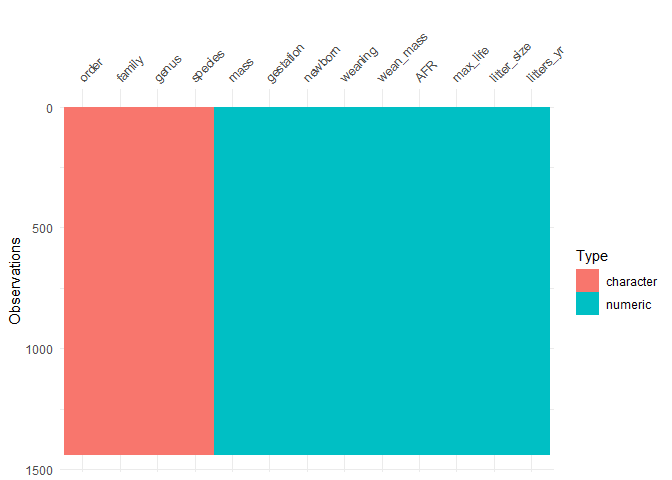
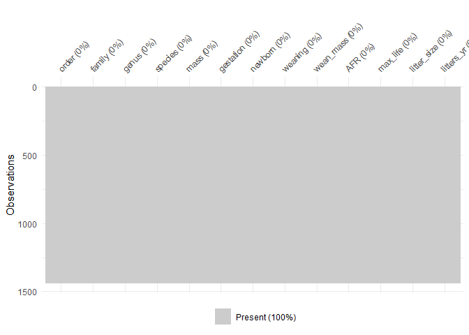

## Learning Goals
*At the end of this exercise, you will be able to:*    
1. Produce summaries of the number of NA's in a data set.  
2. Replace values with `NA` in a data set as appropriate.  

## Review
In the last section we practiced wrangling untidy data using `tidyr`. We also learned the `summarize()` function and `group_by()` to produce useful summaries of our data. But, we ended the last session with the discovery of NA's and how they can impact analyses. This is a big issue in data science and we will spend the remainder of this lab learning how to manage data with missing values.  

## Install `naniar` and `skimr`

```r
#install.packages("naniar")
#install.packages("skimr")
```

## Load the libraries

```r
library("tidyverse")
```

```
## -- Attaching packages --------------------------------------- tidyverse 1.3.0 --
```

```
## v ggplot2 3.2.1     v purrr   0.3.3
## v tibble  2.1.3     v dplyr   0.8.4
## v tidyr   1.0.2     v stringr 1.4.0
## v readr   1.3.1     v forcats 0.4.0
```

```
## -- Conflicts ------------------------------------------ tidyverse_conflicts() --
## x dplyr::filter() masks stats::filter()
## x dplyr::lag()    masks stats::lag()
```

```r
library("naniar")
library("skimr")
```

```
## 
## Attaching package: 'skimr'
```

```
## The following object is masked from 'package:naniar':
## 
##     n_complete
```

## Dealing with NA's
In almost all scientific data, there are missing observations. These can be tricky to deal with, partly because you first need to determine how missing values were treated in the original study. Scientists use different conventions in showing missing data; some use blank spaces, others use "-", etc. Unfourtunately, sometimes **missing data is indicated with numerics like -999.0 or zero!**, though this can be required in some situations (for example raster data). Often, a combination of methods are used. It is up to the data analyst to find out how missing values are represented in the data set and to deal with them appropriately. 

## Practice
For the following, we will use life history data for mammals. The [data](http://esapubs.org/archive/ecol/E084/093/) are from:  
**S. K. Morgan Ernest. 2003. Life history characteristics of placental non-volant mammals. Ecology 84:3402.**  

1. Load the mammals life history data. Do you see any NA's?

```r
life_history <- 
  readr::read_csv("data/mammal_lifehistories_v2.csv")
```

```
## Parsed with column specification:
## cols(
##   order = col_character(),
##   family = col_character(),
##   Genus = col_character(),
##   species = col_character(),
##   mass = col_double(),
##   gestation = col_double(),
##   newborn = col_double(),
##   weaning = col_double(),
##   `wean mass` = col_double(),
##   AFR = col_double(),
##   `max. life` = col_double(),
##   `litter size` = col_double(),
##   `litters/year` = col_double()
## )
```

```r
life_history
```

```
## # A tibble: 1,440 x 13
##    order family Genus species   mass gestation newborn weaning `wean mass`
##    <chr> <chr>  <chr> <chr>    <dbl>     <dbl>   <dbl>   <dbl>       <dbl>
##  1 Arti~ Antil~ Anti~ americ~ 4.54e4      8.13   3246.    3           8900
##  2 Arti~ Bovid~ Addax nasoma~ 1.82e5      9.39   5480     6.5         -999
##  3 Arti~ Bovid~ Aepy~ melamp~ 4.15e4      6.35   5093     5.63       15900
##  4 Arti~ Bovid~ Alce~ busela~ 1.50e5      7.9   10167.    6.5         -999
##  5 Arti~ Bovid~ Ammo~ clarkei 2.85e4      6.8    -999  -999           -999
##  6 Arti~ Bovid~ Ammo~ lervia  5.55e4      5.08   3810     4           -999
##  7 Arti~ Bovid~ Anti~ marsup~ 3.00e4      5.72   3910     4.04        -999
##  8 Arti~ Bovid~ Anti~ cervic~ 3.75e4      5.5    3846     2.13        -999
##  9 Arti~ Bovid~ Bison bison   4.98e5      8.93  20000    10.7       157500
## 10 Arti~ Bovid~ Bison bonasus 5.00e5      9.14  23000.    6.6         -999
## # ... with 1,430 more rows, and 4 more variables: AFR <dbl>, `max. life` <dbl>,
## #   `litter size` <dbl>, `litters/year` <dbl>
```

2. What are the possible problems if missing data are indicated by "-999.0" or "0"?
Could be treated as a value, not NA

## For the following examples, we will use the built-in `msleep` data

```r
?msleep
```

```
## starting httpd help server ... done
```

```r
glimpse(msleep)
```

```
## Observations: 83
## Variables: 11
## $ name         <chr> "Cheetah", "Owl monkey", "Mountain beaver", "Greater s...
## $ genus        <chr> "Acinonyx", "Aotus", "Aplodontia", "Blarina", "Bos", "...
## $ vore         <chr> "carni", "omni", "herbi", "omni", "herbi", "herbi", "c...
## $ order        <chr> "Carnivora", "Primates", "Rodentia", "Soricomorpha", "...
## $ conservation <chr> "lc", NA, "nt", "lc", "domesticated", NA, "vu", NA, "d...
## $ sleep_total  <dbl> 12.1, 17.0, 14.4, 14.9, 4.0, 14.4, 8.7, 7.0, 10.1, 3.0...
## $ sleep_rem    <dbl> NA, 1.8, 2.4, 2.3, 0.7, 2.2, 1.4, NA, 2.9, NA, 0.6, 0....
## $ sleep_cycle  <dbl> NA, NA, NA, 0.1333333, 0.6666667, 0.7666667, 0.3833333...
## $ awake        <dbl> 11.9, 7.0, 9.6, 9.1, 20.0, 9.6, 15.3, 17.0, 13.9, 21.0...
## $ brainwt      <dbl> NA, 0.01550, NA, 0.00029, 0.42300, NA, NA, NA, 0.07000...
## $ bodywt       <dbl> 50.000, 0.480, 1.350, 0.019, 600.000, 3.850, 20.490, 0...
```

## Are there any NA's?
Let's first check to see if our data has any NA's. `is.na()` is a function that determines whether a value in a data frame is or is not an NA. This is evaluated logically as TRUE or FALSE.  

Keep in mind, these are the values that R is interpreting as NA. If the authors of the data represented NA's in another way, they will not be detected by R.

```r
is.na(msleep)
```

```
##        name genus  vore order conservation sleep_total sleep_rem sleep_cycle
##  [1,] FALSE FALSE FALSE FALSE        FALSE       FALSE      TRUE        TRUE
##  [2,] FALSE FALSE FALSE FALSE         TRUE       FALSE     FALSE        TRUE
##  [3,] FALSE FALSE FALSE FALSE        FALSE       FALSE     FALSE        TRUE
##  [4,] FALSE FALSE FALSE FALSE        FALSE       FALSE     FALSE       FALSE
##  [5,] FALSE FALSE FALSE FALSE        FALSE       FALSE     FALSE       FALSE
##  [6,] FALSE FALSE FALSE FALSE         TRUE       FALSE     FALSE       FALSE
##  [7,] FALSE FALSE FALSE FALSE        FALSE       FALSE     FALSE       FALSE
##  [8,] FALSE FALSE  TRUE FALSE         TRUE       FALSE      TRUE        TRUE
##  [9,] FALSE FALSE FALSE FALSE        FALSE       FALSE     FALSE       FALSE
## [10,] FALSE FALSE FALSE FALSE        FALSE       FALSE      TRUE        TRUE
## [11,] FALSE FALSE FALSE FALSE        FALSE       FALSE     FALSE        TRUE
## [12,] FALSE FALSE FALSE FALSE        FALSE       FALSE     FALSE       FALSE
## [13,] FALSE FALSE FALSE FALSE        FALSE       FALSE     FALSE        TRUE
## [14,] FALSE FALSE FALSE FALSE        FALSE       FALSE     FALSE       FALSE
## [15,] FALSE FALSE FALSE FALSE        FALSE       FALSE     FALSE        TRUE
## [16,] FALSE FALSE FALSE FALSE         TRUE       FALSE     FALSE        TRUE
## [17,] FALSE FALSE FALSE FALSE        FALSE       FALSE     FALSE       FALSE
## [18,] FALSE FALSE FALSE FALSE        FALSE       FALSE     FALSE       FALSE
## [19,] FALSE FALSE FALSE FALSE        FALSE       FALSE     FALSE        TRUE
## [20,] FALSE FALSE FALSE FALSE        FALSE       FALSE     FALSE       FALSE
## [21,] FALSE FALSE FALSE FALSE        FALSE       FALSE      TRUE        TRUE
## [22,] FALSE FALSE FALSE FALSE        FALSE       FALSE     FALSE       FALSE
## [23,] FALSE FALSE FALSE FALSE        FALSE       FALSE     FALSE       FALSE
## [24,] FALSE FALSE FALSE FALSE        FALSE       FALSE     FALSE        TRUE
## [25,] FALSE FALSE FALSE FALSE        FALSE       FALSE     FALSE       FALSE
## [26,] FALSE FALSE FALSE FALSE        FALSE       FALSE     FALSE        TRUE
## [27,] FALSE FALSE FALSE FALSE         TRUE       FALSE      TRUE        TRUE
## [28,] FALSE FALSE FALSE FALSE        FALSE       FALSE     FALSE       FALSE
## [29,] FALSE FALSE FALSE FALSE         TRUE       FALSE     FALSE       FALSE
## [30,] FALSE FALSE FALSE FALSE        FALSE       FALSE     FALSE        TRUE
## [31,] FALSE FALSE FALSE FALSE        FALSE       FALSE     FALSE        TRUE
## [32,] FALSE FALSE FALSE FALSE        FALSE       FALSE     FALSE        TRUE
## [33,] FALSE FALSE FALSE FALSE        FALSE       FALSE     FALSE        TRUE
## [34,] FALSE FALSE FALSE FALSE         TRUE       FALSE     FALSE       FALSE
## [35,] FALSE FALSE FALSE FALSE        FALSE       FALSE     FALSE        TRUE
## [36,] FALSE FALSE FALSE FALSE        FALSE       FALSE      TRUE        TRUE
## [37,] FALSE FALSE FALSE FALSE        FALSE       FALSE     FALSE        TRUE
## [38,] FALSE FALSE FALSE FALSE         TRUE       FALSE     FALSE       FALSE
## [39,] FALSE FALSE FALSE FALSE        FALSE       FALSE     FALSE        TRUE
## [40,] FALSE FALSE FALSE FALSE        FALSE       FALSE     FALSE       FALSE
## [41,] FALSE FALSE FALSE FALSE         TRUE       FALSE      TRUE        TRUE
## [42,] FALSE FALSE FALSE FALSE        FALSE       FALSE     FALSE       FALSE
## [43,] FALSE FALSE FALSE FALSE         TRUE       FALSE     FALSE       FALSE
## [44,] FALSE FALSE FALSE FALSE        FALSE       FALSE      TRUE        TRUE
## [45,] FALSE FALSE FALSE FALSE         TRUE       FALSE      TRUE        TRUE
## [46,] FALSE FALSE FALSE FALSE        FALSE       FALSE     FALSE        TRUE
## [47,] FALSE FALSE FALSE FALSE        FALSE       FALSE      TRUE        TRUE
## [48,] FALSE FALSE FALSE FALSE        FALSE       FALSE     FALSE       FALSE
## [49,] FALSE FALSE FALSE FALSE        FALSE       FALSE     FALSE        TRUE
## [50,] FALSE FALSE FALSE FALSE         TRUE       FALSE     FALSE       FALSE
## [51,] FALSE FALSE FALSE FALSE        FALSE       FALSE      TRUE        TRUE
## [52,] FALSE FALSE FALSE FALSE        FALSE       FALSE      TRUE        TRUE
## [53,] FALSE FALSE FALSE FALSE        FALSE       FALSE      TRUE        TRUE
## [54,] FALSE FALSE FALSE FALSE         TRUE       FALSE     FALSE       FALSE
## [55,] FALSE FALSE  TRUE FALSE        FALSE       FALSE     FALSE        TRUE
## [56,] FALSE FALSE FALSE FALSE        FALSE       FALSE      TRUE        TRUE
## [57,] FALSE FALSE  TRUE FALSE         TRUE       FALSE      TRUE        TRUE
## [58,] FALSE FALSE  TRUE FALSE         TRUE       FALSE     FALSE        TRUE
## [59,] FALSE FALSE FALSE FALSE        FALSE       FALSE     FALSE        TRUE
## [60,] FALSE FALSE FALSE FALSE        FALSE       FALSE      TRUE        TRUE
## [61,] FALSE FALSE FALSE FALSE         TRUE       FALSE     FALSE        TRUE
## [62,] FALSE FALSE FALSE FALSE        FALSE       FALSE     FALSE        TRUE
## [63,] FALSE FALSE  TRUE FALSE        FALSE       FALSE     FALSE        TRUE
## [64,] FALSE FALSE FALSE FALSE        FALSE       FALSE     FALSE       FALSE
## [65,] FALSE FALSE FALSE FALSE         TRUE       FALSE      TRUE        TRUE
## [66,] FALSE FALSE FALSE FALSE         TRUE       FALSE     FALSE        TRUE
## [67,] FALSE FALSE FALSE FALSE        FALSE       FALSE     FALSE       FALSE
## [68,] FALSE FALSE FALSE FALSE         TRUE       FALSE     FALSE       FALSE
## [69,] FALSE FALSE  TRUE FALSE         TRUE       FALSE     FALSE        TRUE
## [70,] FALSE FALSE FALSE FALSE        FALSE       FALSE      TRUE        TRUE
## [71,] FALSE FALSE FALSE FALSE        FALSE       FALSE     FALSE       FALSE
## [72,] FALSE FALSE FALSE FALSE        FALSE       FALSE     FALSE        TRUE
## [73,] FALSE FALSE  TRUE FALSE         TRUE       FALSE     FALSE       FALSE
## [74,] FALSE FALSE FALSE FALSE        FALSE       FALSE     FALSE       FALSE
## [75,] FALSE FALSE FALSE FALSE         TRUE       FALSE      TRUE        TRUE
## [76,] FALSE FALSE FALSE FALSE         TRUE       FALSE      TRUE        TRUE
## [77,] FALSE FALSE FALSE FALSE        FALSE       FALSE     FALSE       FALSE
## [78,] FALSE FALSE FALSE FALSE         TRUE       FALSE     FALSE        TRUE
## [79,] FALSE FALSE FALSE FALSE         TRUE       FALSE     FALSE       FALSE
## [80,] FALSE FALSE FALSE FALSE         TRUE       FALSE      TRUE        TRUE
## [81,] FALSE FALSE FALSE FALSE         TRUE       FALSE     FALSE        TRUE
## [82,] FALSE FALSE FALSE FALSE         TRUE       FALSE      TRUE        TRUE
## [83,] FALSE FALSE FALSE FALSE         TRUE       FALSE     FALSE       FALSE
##       awake brainwt bodywt
##  [1,] FALSE    TRUE  FALSE
##  [2,] FALSE   FALSE  FALSE
##  [3,] FALSE    TRUE  FALSE
##  [4,] FALSE   FALSE  FALSE
##  [5,] FALSE   FALSE  FALSE
##  [6,] FALSE    TRUE  FALSE
##  [7,] FALSE    TRUE  FALSE
##  [8,] FALSE    TRUE  FALSE
##  [9,] FALSE   FALSE  FALSE
## [10,] FALSE   FALSE  FALSE
## [11,] FALSE   FALSE  FALSE
## [12,] FALSE   FALSE  FALSE
## [13,] FALSE    TRUE  FALSE
## [14,] FALSE   FALSE  FALSE
## [15,] FALSE   FALSE  FALSE
## [16,] FALSE   FALSE  FALSE
## [17,] FALSE   FALSE  FALSE
## [18,] FALSE   FALSE  FALSE
## [19,] FALSE   FALSE  FALSE
## [20,] FALSE   FALSE  FALSE
## [21,] FALSE   FALSE  FALSE
## [22,] FALSE   FALSE  FALSE
## [23,] FALSE   FALSE  FALSE
## [24,] FALSE   FALSE  FALSE
## [25,] FALSE   FALSE  FALSE
## [26,] FALSE   FALSE  FALSE
## [27,] FALSE    TRUE  FALSE
## [28,] FALSE   FALSE  FALSE
## [29,] FALSE   FALSE  FALSE
## [30,] FALSE    TRUE  FALSE
## [31,] FALSE    TRUE  FALSE
## [32,] FALSE   FALSE  FALSE
## [33,] FALSE   FALSE  FALSE
## [34,] FALSE   FALSE  FALSE
## [35,] FALSE    TRUE  FALSE
## [36,] FALSE   FALSE  FALSE
## [37,] FALSE    TRUE  FALSE
## [38,] FALSE   FALSE  FALSE
## [39,] FALSE    TRUE  FALSE
## [40,] FALSE   FALSE  FALSE
## [41,] FALSE    TRUE  FALSE
## [42,] FALSE   FALSE  FALSE
## [43,] FALSE   FALSE  FALSE
## [44,] FALSE    TRUE  FALSE
## [45,] FALSE   FALSE  FALSE
## [46,] FALSE    TRUE  FALSE
## [47,] FALSE    TRUE  FALSE
## [48,] FALSE   FALSE  FALSE
## [49,] FALSE   FALSE  FALSE
## [50,] FALSE   FALSE  FALSE
## [51,] FALSE    TRUE  FALSE
## [52,] FALSE   FALSE  FALSE
## [53,] FALSE    TRUE  FALSE
## [54,] FALSE   FALSE  FALSE
## [55,] FALSE   FALSE  FALSE
## [56,] FALSE    TRUE  FALSE
## [57,] FALSE    TRUE  FALSE
## [58,] FALSE   FALSE  FALSE
## [59,] FALSE    TRUE  FALSE
## [60,] FALSE    TRUE  FALSE
## [61,] FALSE    TRUE  FALSE
## [62,] FALSE   FALSE  FALSE
## [63,] FALSE   FALSE  FALSE
## [64,] FALSE   FALSE  FALSE
## [65,] FALSE    TRUE  FALSE
## [66,] FALSE   FALSE  FALSE
## [67,] FALSE   FALSE  FALSE
## [68,] FALSE   FALSE  FALSE
## [69,] FALSE   FALSE  FALSE
## [70,] FALSE   FALSE  FALSE
## [71,] FALSE   FALSE  FALSE
## [72,] FALSE    TRUE  FALSE
## [73,] FALSE   FALSE  FALSE
## [74,] FALSE   FALSE  FALSE
## [75,] FALSE   FALSE  FALSE
## [76,] FALSE    TRUE  FALSE
## [77,] FALSE   FALSE  FALSE
## [78,] FALSE   FALSE  FALSE
## [79,] FALSE   FALSE  FALSE
## [80,] FALSE    TRUE  FALSE
## [81,] FALSE   FALSE  FALSE
## [82,] FALSE   FALSE  FALSE
## [83,] FALSE   FALSE  FALSE
```

OK, what are we supposed to do with that? Unless you have a small data frame, applying the `is.na()` function is not helpful but we can use the code in another way. Let's incorporate it into the `summarize()` function.

```r
msleep %>% 
  summarize(number_nas = sum(is.na(msleep)))
```

```
## # A tibble: 1 x 1
##   number_nas
##        <int>
## 1        136
```

This is better, but we still don't have any idea of where those NA's are in our data frame. If there were a systemic problem in the data it would be hard to determine. In order to do this, we need to apply `is.na()` to each variable of interest.

```r
msleep %>% 
  summarize(number_nas = sum(is.na(conservation)))
```

```
## # A tibble: 1 x 1
##   number_nas
##        <int>
## 1         29
```

The `summary()` function in base R will tally NAs by variable, but only for categorical/factor, numeric, integer, or logical columns. What about any NA values in the character columns?

```r
summary(msleep)
```

```
##      name              genus               vore              order          
##  Length:83          Length:83          Length:83          Length:83         
##  Class :character   Class :character   Class :character   Class :character  
##  Mode  :character   Mode  :character   Mode  :character   Mode  :character  
##                                                                             
##                                                                             
##                                                                             
##                                                                             
##  conservation        sleep_total      sleep_rem      sleep_cycle    
##  Length:83          Min.   : 1.90   Min.   :0.100   Min.   :0.1167  
##  Class :character   1st Qu.: 7.85   1st Qu.:0.900   1st Qu.:0.1833  
##  Mode  :character   Median :10.10   Median :1.500   Median :0.3333  
##                     Mean   :10.43   Mean   :1.875   Mean   :0.4396  
##                     3rd Qu.:13.75   3rd Qu.:2.400   3rd Qu.:0.5792  
##                     Max.   :19.90   Max.   :6.600   Max.   :1.5000  
##                                     NA's   :22      NA's   :51      
##      awake          brainwt            bodywt        
##  Min.   : 4.10   Min.   :0.00014   Min.   :   0.005  
##  1st Qu.:10.25   1st Qu.:0.00290   1st Qu.:   0.174  
##  Median :13.90   Median :0.01240   Median :   1.670  
##  Mean   :13.57   Mean   :0.28158   Mean   : 166.136  
##  3rd Qu.:16.15   3rd Qu.:0.12550   3rd Qu.:  41.750  
##  Max.   :22.10   Max.   :5.71200   Max.   :6654.000  
##                  NA's   :27
```

## Practice
1. Load the data `import_export.csv` and store it as a new object `import_export`.

```r
import_export <- readr::read_csv("data/import_export.csv")
```

```
## Parsed with column specification:
## cols(
##   Country = col_character(),
##   Import = col_double(),
##   Export = col_double(),
##   Product = col_character()
## )
```


2. Are there NAs in the data? Evaluate this logically (true/false).

```r
is.na(import_export)
```

```
##       Country Import Export Product
##  [1,]   FALSE  FALSE  FALSE   FALSE
##  [2,]   FALSE  FALSE  FALSE   FALSE
##  [3,]   FALSE  FALSE  FALSE   FALSE
##  [4,]   FALSE  FALSE  FALSE   FALSE
##  [5,]   FALSE  FALSE  FALSE   FALSE
##  [6,]   FALSE  FALSE  FALSE   FALSE
##  [7,]   FALSE   TRUE  FALSE   FALSE
##  [8,]   FALSE  FALSE  FALSE   FALSE
##  [9,]   FALSE  FALSE  FALSE   FALSE
## [10,]   FALSE  FALSE  FALSE   FALSE
## [11,]   FALSE  FALSE  FALSE   FALSE
## [12,]   FALSE  FALSE   TRUE   FALSE
## [13,]   FALSE  FALSE  FALSE   FALSE
## [14,]   FALSE  FALSE  FALSE   FALSE
## [15,]   FALSE  FALSE  FALSE   FALSE
## [16,]   FALSE   TRUE  FALSE   FALSE
## [17,]   FALSE  FALSE  FALSE   FALSE
## [18,]   FALSE  FALSE   TRUE   FALSE
## [19,]   FALSE  FALSE  FALSE   FALSE
## [20,]   FALSE   TRUE  FALSE   FALSE
```


3. How many total NAs are present?

```r
import_export %>% 
  summarize(total_na = sum(is.na(import_export)))
```

```
## # A tibble: 1 x 1
##   total_na
##      <int>
## 1        5
```


## NAs in large datasets using `purr`
What if we are working with hundreds or thousands (or more!) variables?! In order to deal with this problem efficiently we can use another package in the tidyverse called `purrr`.  

This handy bit of code generates a new data frame that sums all NA's accross variables.

```r
msleep %>%
  purrr::map_df(~ sum(is.na(.))) #map to a new data frame the sum results of the is.na function for all columns
```

```
## # A tibble: 1 x 11
##    name genus  vore order conservation sleep_total sleep_rem sleep_cycle awake
##   <int> <int> <int> <int>        <int>       <int>     <int>       <int> <int>
## 1     0     0     7     0           29           0        22          51     0
## # ... with 2 more variables: brainwt <int>, bodywt <int>
```

Don't forget that we can use `gather()` to make viewing this output easier.

```r
msleep %>% 
  purrr::map_df(~ sum(is.na(.))) %>% 
  pivot_longer(everything(),
    names_to= "variables",
    values_to = "num_nas") %>% 
  arrange(desc(num_nas))
```

```
## # A tibble: 11 x 2
##    variables    num_nas
##    <chr>          <int>
##  1 sleep_cycle       51
##  2 conservation      29
##  3 brainwt           27
##  4 sleep_rem         22
##  5 vore               7
##  6 name               0
##  7 genus              0
##  8 order              0
##  9 sleep_total        0
## 10 awake              0
## 11 bodywt             0
```

This is much better, but we need to be careful. R can have difficulty interpreting missing data. This is especially true for categorical variables. Always do a reality check if the output doesn't make sense to you. A quick check never hurts and can save you from wasting time in the future or from drawing false conclusions.  

You can explore a specific variable more intently using `count()`. This operates similarly to `group_by()`.

```r
msleep %>% 
  count(conservation)
```

```
## # A tibble: 7 x 2
##   conservation     n
##   <chr>        <int>
## 1 cd               2
## 2 domesticated    10
## 3 en               4
## 4 lc              27
## 5 nt               4
## 6 vu               7
## 7 <NA>            29
```

Adding the `sort=TRUE` option automatically makes a descending list. We confirm that there are 29 NA's within the conservation variable.

```r
msleep %>% 
  count(conservation, sort = TRUE)
```

```
## # A tibble: 7 x 2
##   conservation     n
##   <chr>        <int>
## 1 <NA>            29
## 2 lc              27
## 3 domesticated    10
## 4 vu               7
## 5 en               4
## 6 nt               4
## 7 cd               2
```

It is true that all of this is redundant, but you want to be able to run multiple checks on the data. Remember, just because your code runs without errors doesn't mean it is doing what you intended.  

## Replacing NAs with `na_if()` and `mutate()`
The bit of code below is very handy, especially if the data has NAs represented as **actual values that you want replaced** or if you want to make sure any blanks are treated as NA. You can also use it to treat specific values as NA.  

Let's say we know that NA's are represented by "-999". We can replace this value with NA accross the data frame.

```r
msleep %>% 
  na_if("-999")
```

```
## # A tibble: 83 x 11
##    name  genus vore  order conservation sleep_total sleep_rem sleep_cycle awake
##    <chr> <chr> <chr> <chr> <chr>              <dbl>     <dbl>       <dbl> <dbl>
##  1 Chee~ Acin~ carni Carn~ lc                  12.1      NA        NA      11.9
##  2 Owl ~ Aotus omni  Prim~ <NA>                17         1.8      NA       7  
##  3 Moun~ Aplo~ herbi Rode~ nt                  14.4       2.4      NA       9.6
##  4 Grea~ Blar~ omni  Sori~ lc                  14.9       2.3       0.133   9.1
##  5 Cow   Bos   herbi Arti~ domesticated         4         0.7       0.667  20  
##  6 Thre~ Brad~ herbi Pilo~ <NA>                14.4       2.2       0.767   9.6
##  7 Nort~ Call~ carni Carn~ vu                   8.7       1.4       0.383  15.3
##  8 Vesp~ Calo~ <NA>  Rode~ <NA>                 7        NA        NA      17  
##  9 Dog   Canis carni Carn~ domesticated        10.1       2.9       0.333  13.9
## 10 Roe ~ Capr~ herbi Arti~ lc                   3        NA        NA      21  
## # ... with 73 more rows, and 2 more variables: brainwt <dbl>, bodywt <dbl>
```

Let's say we want to treat "domesticated" as NA in the conservation column. For this, we use `mutate()`.

```r
msleep %>%  
  mutate(conservation = na_if(conservation, "domesticated"))%>% 
  count(conservation, sort = TRUE) #previously there were only 29 NAs
```

```
## # A tibble: 6 x 2
##   conservation     n
##   <chr>        <int>
## 1 <NA>            39
## 2 lc              27
## 3 vu               7
## 4 en               4
## 5 nt               4
## 6 cd               2
```

## Practice
For the following examples, we will go back to the `life_history` data. First, let's rename some of the variables.

```r
life_history <- 
  life_history %>% 
  dplyr::rename(
          genus        = Genus,
          wean_mass    = `wean mass`,
          max_life     = `max. life`,
          litter_size  = `litter size`,
          litters_yr   = `litters/year`
          )
```

1. Explore the data using any method that you prefer. Below, I show a package called `skimr`. If you want to try this, make sure that it is installed and loaded.  

`skimr` provides a nice output with histograms for numeric variables.

```r
life_history %>% 
  skimr::skim()
```


Table: Data summary

                                      
-------------------------  -----------
Name                       Piped data 
Number of rows             1440       
Number of columns          13         
_______________________               
Column type frequency:                
character                  4          
numeric                    9          
________________________              
Group variables            None       
-------------------------  -----------


**Variable type: character**

skim_variable    n_missing   complete_rate   min   max   empty   n_unique   whitespace
--------------  ----------  --------------  ----  ----  ------  ---------  -----------
order                    0               1     7    14       0         17            0
family                   0               1     6    15       0         96            0
genus                    0               1     3    16       0        618            0
species                  0               1     3    17       0       1191            0


**Variable type: numeric**

skim_variable    n_missing   complete_rate        mean           sd     p0    p25       p50       p75         p100  hist  
--------------  ----------  --------------  ----------  -----------  -----  -----  --------  --------  -----------  ------
mass                     0               1   383576.72   5055162.92   -999     50    403.02   7009.17   1.4900e+08  ▇▁▁▁▁ 
gestation                0               1     -287.25       455.36   -999   -999      1.05      4.50   2.1460e+01  ▃▁▁▁▇ 
newborn                  0               1     6703.15     90912.52   -999   -999      2.65     98.00   2.2500e+06  ▇▁▁▁▁ 
weaning                  0               1     -427.17       496.71   -999   -999      0.73      2.00   4.8000e+01  ▆▁▁▁▇ 
wean_mass                0               1    16048.93    503650.17   -999   -999   -999.00     10.00   1.9075e+07  ▇▁▁▁▁ 
AFR                      0               1     -408.12       504.97   -999   -999      2.50     15.61   2.1000e+02  ▆▁▁▁▇ 
max_life                 0               1     -490.26       615.30   -999   -999   -999.00    147.25   1.3680e+03  ▇▁▅▁▁ 
litter_size              0               1      -55.63       234.88   -999      1      2.27      3.84   1.4180e+01  ▁▁▁▁▇ 
litters_yr               0               1     -477.14       500.03   -999   -999      0.38      1.15   7.5000e+00  ▇▁▁▁▇ 

2. Reconsider the practice question from the beginning of the lab. Are there any NA's in the data? Does this seem likely? Do the mean values from the `skim()` output above make sense?  
There is definitely NA

```r
life_history %>% 
  summarize(total_na=sum(is.na(life_history)))
```

```
## # A tibble: 1 x 1
##   total_na
##      <int>
## 1        0
```


3. Replace the entries that represent NA's in the data using `na_if()`. Double check your work and compare to #2 above.

```r
life_history2 <- 
  life_history %>% 
  na_if("-999")
life_history2 %>% 
  summarize(total_na=sum(is.na(life_history2)))
```

```
## # A tibble: 1 x 1
##   total_na
##      <int>
## 1     4977
```

4. In which variable are the most NAs in the data frame?

```r
life_history2 %>% 
  purrr::map_df(~ sum(is.na(.))) %>% 
  pivot_longer(everything(),
    names_to= "variables",
    values_to = "num_nas") %>% 
  arrange(desc(num_nas))
```

```
## # A tibble: 13 x 2
##    variables   num_nas
##    <chr>         <int>
##  1 wean_mass      1039
##  2 max_life        841
##  3 litters_yr      689
##  4 weaning         619
##  5 AFR             607
##  6 newborn         595
##  7 gestation       418
##  8 mass             85
##  9 litter_size      84
## 10 order             0
## 11 family            0
## 12 genus             0
## 13 species           0
```


## `naniar`
`naniar` is a package that is built to manage NAs. Many of the functions it performs can be performed using tidyverse functions above, but it does provide some interesting options.

`miss_var_summary` provides a clean summary of NAs across the dataframe.

```r
naniar::miss_var_summary(life_history2)
```

```
## # A tibble: 13 x 3
##    variable    n_miss pct_miss
##    <chr>        <int>    <dbl>
##  1 wean_mass     1039    72.2 
##  2 max_life       841    58.4 
##  3 litters_yr     689    47.8 
##  4 weaning        619    43.0 
##  5 AFR            607    42.2 
##  6 newborn        595    41.3 
##  7 gestation      418    29.0 
##  8 mass            85     5.90
##  9 litter_size     84     5.83
## 10 order            0     0   
## 11 family           0     0   
## 12 genus            0     0   
## 13 species          0     0
```


We can also use `miss_var_summary` with `group_by()`.

```r
life_history2 %>%
  group_by(order) %>%
  select(order, wean_mass) %>% 
  naniar::miss_var_summary(order=T)
```

```
## Warning: `cols` is now required.
## Please use `cols = c(data)`
```

```
## # A tibble: 17 x 4
## # Groups:   order [17]
##    order          variable  n_miss pct_miss
##    <chr>          <chr>      <int>    <dbl>
##  1 Artiodactyla   wean_mass    134     83.2
##  2 Carnivora      wean_mass    120     60.9
##  3 Cetacea        wean_mass     51     92.7
##  4 Dermoptera     wean_mass      2    100  
##  5 Hyracoidea     wean_mass      3     75  
##  6 Insectivora    wean_mass     67     73.6
##  7 Lagomorpha     wean_mass     28     66.7
##  8 Macroscelidea  wean_mass      8     80  
##  9 Perissodactyla wean_mass     12     80  
## 10 Pholidota      wean_mass      3     42.9
## 11 Primates       wean_mass    108     69.2
## 12 Proboscidea    wean_mass      1     50  
## 13 Rodentia       wean_mass    474     71.3
## 14 Scandentia     wean_mass      5     71.4
## 15 Sirenia        wean_mass      4     80  
## 16 Tubulidentata  wean_mass      0      0  
## 17 Xenarthra      wean_mass     19     95
```

We can also replace -999 with NA as before. This shows replacement within the newborn column.

```r
life_history %>% 
  naniar::replace_with_na(replace = list(newborn = -999))
```

```
## # A tibble: 1,440 x 13
##    order family genus species   mass gestation newborn weaning wean_mass    AFR
##    <chr> <chr>  <chr> <chr>    <dbl>     <dbl>   <dbl>   <dbl>     <dbl>  <dbl>
##  1 Arti~ Antil~ Anti~ americ~ 4.54e4      8.13   3246.    3         8900   13.5
##  2 Arti~ Bovid~ Addax nasoma~ 1.82e5      9.39   5480     6.5       -999   27.3
##  3 Arti~ Bovid~ Aepy~ melamp~ 4.15e4      6.35   5093     5.63     15900   16.7
##  4 Arti~ Bovid~ Alce~ busela~ 1.50e5      7.9   10167.    6.5       -999   23.0
##  5 Arti~ Bovid~ Ammo~ clarkei 2.85e4      6.8      NA  -999         -999 -999  
##  6 Arti~ Bovid~ Ammo~ lervia  5.55e4      5.08   3810     4         -999   14.9
##  7 Arti~ Bovid~ Anti~ marsup~ 3.00e4      5.72   3910     4.04      -999   10.2
##  8 Arti~ Bovid~ Anti~ cervic~ 3.75e4      5.5    3846     2.13      -999   20.1
##  9 Arti~ Bovid~ Bison bison   4.98e5      8.93  20000    10.7     157500   29.4
## 10 Arti~ Bovid~ Bison bonasus 5.00e5      9.14  23000.    6.6       -999   30.0
## # ... with 1,430 more rows, and 3 more variables: max_life <dbl>,
## #   litter_size <dbl>, litters_yr <dbl>
```

This shows replacement within the newborn and weaning columns.

```r
life_history %>% 
  naniar::replace_with_na(replace = list(newborn = -999, weaning= -999))
```

```
## # A tibble: 1,440 x 13
##    order family genus species   mass gestation newborn weaning wean_mass    AFR
##    <chr> <chr>  <chr> <chr>    <dbl>     <dbl>   <dbl>   <dbl>     <dbl>  <dbl>
##  1 Arti~ Antil~ Anti~ americ~ 4.54e4      8.13   3246.    3         8900   13.5
##  2 Arti~ Bovid~ Addax nasoma~ 1.82e5      9.39   5480     6.5       -999   27.3
##  3 Arti~ Bovid~ Aepy~ melamp~ 4.15e4      6.35   5093     5.63     15900   16.7
##  4 Arti~ Bovid~ Alce~ busela~ 1.50e5      7.9   10167.    6.5       -999   23.0
##  5 Arti~ Bovid~ Ammo~ clarkei 2.85e4      6.8      NA    NA         -999 -999  
##  6 Arti~ Bovid~ Ammo~ lervia  5.55e4      5.08   3810     4         -999   14.9
##  7 Arti~ Bovid~ Anti~ marsup~ 3.00e4      5.72   3910     4.04      -999   10.2
##  8 Arti~ Bovid~ Anti~ cervic~ 3.75e4      5.5    3846     2.13      -999   20.1
##  9 Arti~ Bovid~ Bison bison   4.98e5      8.93  20000    10.7     157500   29.4
## 10 Arti~ Bovid~ Bison bonasus 5.00e5      9.14  23000.    6.6       -999   30.0
## # ... with 1,430 more rows, and 3 more variables: max_life <dbl>,
## #   litter_size <dbl>, litters_yr <dbl>
```

## Visualizing NAs
There is another package `visdat` that can be used to visualize the proportion of different classes of data, including missing data.

```r
#install.packages("visdat")
library(visdat)
```


```r
vis_dat(life_history) #classes of data
```

<!-- -->


```r
vis_miss(life_history)
```

<!-- -->

## Dealing with NA's in advance
If you know how NA's are treated in the data, then you can deal with them in advance using `na()` as part of the `readr` package. But, you need to be sure about the analyses you want to conduct and how NA's might be interpreted.  

```r
life_history3 <- 
  readr::read_csv(file = "data/mammal_lifehistories_v2.csv", 
                  na = c("NA", " ", ".", "-999")) #all NA, blank spaces, .,and -999 are treated as NA
```

```
## Parsed with column specification:
## cols(
##   order = col_character(),
##   family = col_character(),
##   Genus = col_character(),
##   species = col_character(),
##   mass = col_double(),
##   gestation = col_double(),
##   newborn = col_double(),
##   weaning = col_double(),
##   `wean mass` = col_double(),
##   AFR = col_double(),
##   `max. life` = col_double(),
##   `litter size` = col_double(),
##   `litters/year` = col_double()
## )
```

## That's it, let's take a break!   

-->[Home](https://jmledford3115.github.io/datascibiol/)
