## Learning Goals
*At the end of this exercise, you will be able to:*    
1. Produce boxplots using `ggplot.`  
2. Customize labels on axes using `labs` and `themes`.  
3. Use `color`, `fill`, and `group` to customize plots and improve overall aesthetics.  

## Resources
- [ggplot2 cheatsheet](https://www.rstudio.com/wp-content/uploads/2015/03/ggplot2-cheatsheet.pdf)
- [`ggplot` themes](https://ggplot2.tidyverse.org/reference/ggtheme.html)

## Libraries

```r
library(tidyverse)
```

## Review
In the last lab you were introduced to `ggplot`. Let's build on this by exploring more geom types and adding some aesthetics.  

## Data
**Database of vertebrate home range sizes.**  
Reference: Tamburello N, Cote IM, Dulvy NK (2015) Energy and the scaling of animal space use. The American Naturalist 186(2):196-211. http://dx.doi.org/10.1086/682070.  
Data: http://datadryad.org/resource/doi:10.5061/dryad.q5j65/1

```r
homerange <- readr::read_csv("data/Tamburelloetal_HomeRangeDatabase.csv")
```

Remember to be mindful of NAs in the data; know how they are represented and how R has interpreted them.

```r
anyNA(homerange)
```

```
## [1] TRUE
```

```r
glimpse(homerange)
```

```
## Observations: 569
## Variables: 24
## $ taxon                      <chr> "lake fishes", "river fishes", "river fish<U+2026>
## $ common.name                <chr> "american eel", "blacktail redhorse", "cen<U+2026>
## $ class                      <chr> "actinopterygii", "actinopterygii", "actin<U+2026>
## $ order                      <chr> "anguilliformes", "cypriniformes", "cyprin<U+2026>
## $ family                     <chr> "anguillidae", "catostomidae", "cyprinidae<U+2026>
## $ genus                      <chr> "anguilla", "moxostoma", "campostoma", "cl<U+2026>
## $ species                    <chr> "rostrata", "poecilura", "anomalum", "fund<U+2026>
## $ primarymethod              <chr> "telemetry", "mark-recapture", "mark-recap<U+2026>
## $ N                          <chr> "16", NA, "20", "26", "17", "5", "2", "2",<U+2026>
## $ mean.mass.g                <dbl> 887.00, 562.00, 34.00, 4.00, 4.00, 3525.00<U+2026>
## $ log10.mass                 <dbl> 2.9479236, 2.7497363, 1.5314789, 0.6020600<U+2026>
## $ alternative.mass.reference <chr> NA, NA, NA, NA, NA, NA, NA, NA, NA, NA, NA<U+2026>
## $ mean.hra.m2                <dbl> 282750.00, 282.10, 116.11, 125.50, 87.10, <U+2026>
## $ log10.hra                  <dbl> 5.4514026, 2.4504031, 2.0648696, 2.0986437<U+2026>
## $ hra.reference              <chr> "Minns, C. K. 1995. Allometry of home rang<U+2026>
## $ realm                      <chr> "aquatic", "aquatic", "aquatic", "aquatic"<U+2026>
## $ thermoregulation           <chr> "ectotherm", "ectotherm", "ectotherm", "ec<U+2026>
## $ locomotion                 <chr> "swimming", "swimming", "swimming", "swimm<U+2026>
## $ trophic.guild              <chr> "carnivore", "carnivore", "carnivore", "ca<U+2026>
## $ dimension                  <chr> "3D", "2D", "2D", "2D", "2D", "2D", "2D", <U+2026>
## $ preymass                   <dbl> NA, NA, NA, NA, NA, NA, 1.39, NA, NA, NA, <U+2026>
## $ log10.preymass             <dbl> NA, NA, NA, NA, NA, NA, 0.1430148, NA, NA,<U+2026>
## $ PPMR                       <dbl> NA, NA, NA, NA, NA, NA, 530, NA, NA, NA, N<U+2026>
## $ prey.size.reference        <chr> NA, NA, NA, NA, NA, NA, "Brose U, et al. 2<U+2026>
```

## Box Plots
Boxplots help us visualize a range of values. So, on the x-axis we typically have something categorical and the y-axis is the range. In the case below, we are plotting `log10.mass` by taxonomic class in the homerange data. `geom_boxplot()` is the geom type for a standard boxplot. The center line in each box represents the median, not the mean.

Let's look at the variable `log10.mass` grouped by taxonomic class.

```r
homerange %>% 
  group_by(class) %>% 
  summarize(min_log10.mass=min(log10.mass),
            max_log10.mass=max(log10.mass),
            mean_log10.mass=mean(log10.mass),
            median_log10.mass=median(log10.mass))
```

```
## # A tibble: 4 x 5
##   class          min_log10.mass max_log10.mass mean_log10.mass median_log10.mass
##   <chr>                   <dbl>          <dbl>           <dbl>             <dbl>
## 1 actinopterygii         -0.658           3.55            2.00              2.08
## 2 aves                    0.712           4.95            1.99              1.82
## 3 mammalia                0.620           6.60            3.25              3.33
## 4 reptilia                0.539           4.03            2.53              2.51
```


```r
homerange %>% 
  ggplot(aes(x = class, y = log10.mass)) +
  geom_boxplot()
```

<!-- -->

## Practice
1. There are more herbivores than carnivores in the homerange data, but how do their masses compare? Make a summary and boxplot that compares their masses. Use `log10.mass`.

```r
homerange %>% 
  group_by(trophic.guild) %>% 
  summarize(min_log10.mass = min(log10.mass),
            median_log10.mass = median(log10.mass),
            mean_log10.mass = mean(log10.mass),
            max_log10.mass = max(log10.mass))
```

```
## # A tibble: 2 x 5
##   trophic.guild min_log10.mass median_log10.mass mean_log10.mass max_log10.mass
##   <chr>                  <dbl>             <dbl>           <dbl>          <dbl>
## 1 carnivore             -0.658              2.28            2.24           5.05
## 2 herbivore              0.398              2.97            3.13           6.60
```

```r
homerange %>% 
  ggplot(aes(x=trophic.guild, y=log10.mass))+
  geom_boxplot()
```

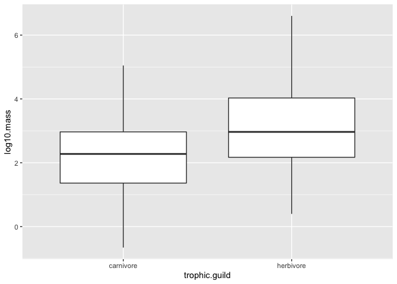<!-- -->


2. Have a closer look at carnivorous mammals. Summarize and visualize the range of log10.mass by family.

```r
carn_mam <- homerange %>% 
  filter(class == "mammalia" & trophic.guild == "carnivore")
carn_mam %>% 
  group_by(family) %>% 
  summarize(min_log10.mass = min(log10.mass),
            median_log10.mass = median(log10.mass),
            mean_log10.mass = mean(log10.mass),
            max_log10.mass = max(log10.mass))
```

```
## # A tibble: 18 x 5
##    family         min_log10.mass median_log10.ma<U+2026> mean_log10.mass max_log10.mass
##    <chr>                   <dbl>            <dbl>           <dbl>          <dbl>
##  1 canidae                 3.32             3.65            3.73            4.44
##  2 chrysochlorid<U+2026>          1.36             2.00            2.00            2.64
##  3 cricetidae              1.34             1.39            1.39            1.44
##  4 dasyuridae              1.36             2.24            2.32            3.45
##  5 didelphidae             1.29             1.38            1.38            1.46
##  6 erinaceidae             2.47             2.69            2.69            2.90
##  7 eupleridae              3.98             3.98            3.98            3.98
##  8 felidae                 3.40             4.05            4.16            5.05
##  9 herpestidae             2.45             3.45            3.16            3.56
## 10 hyanidae                4                4               4               4   
## 11 macroscelidid<U+2026>          1.76             2.30            2.27            2.73
## 12 mustelidae              1.94             2.96            3.08            4.33
## 13 peramelidae             2.59             2.74            2.74            2.89
## 14 soricidae               0.620            0.940           0.882           1.15
## 15 tachyglossidae          2.41             2.41            2.41            2.41
## 16 talpidae                1.68             1.95            1.90            2.01
## 17 ursidae                 4.99             4.99            4.99            4.99
## 18 viverridae              3.24             3.33            3.49            3.90
```

```r
carn_mam %>% 
  ggplot(aes(x=family, y=log10.mass))+
  geom_boxplot()+
  coord_flip()
```

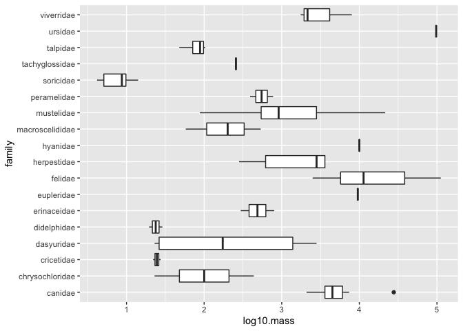<!-- -->


3. Now use a boxplot to visualize the range of body mass by family of carnivore.

```r
homerange %>% 
  filter(trophic.guild == "carnivore") %>% 
  ggplot(aes(x=family, y= log10.mass))+
  geom_boxplot()+
  coord_flip()
```

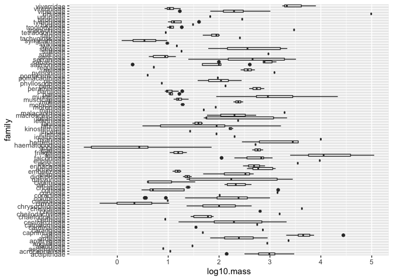<!-- -->


## Aesthetics: Labels
Now that we have practiced scatterplots, barplots, and boxplots we need to learn how to adjust their appearance to suit our needs. Let's start with labelling x and y axes.  

In this example from part 1, we explored the relationship between body mass and homerange.

```r
ggplot(data = homerange, mapping = aes(x = log10.mass, y = log10.hra)) +
  geom_point()
```

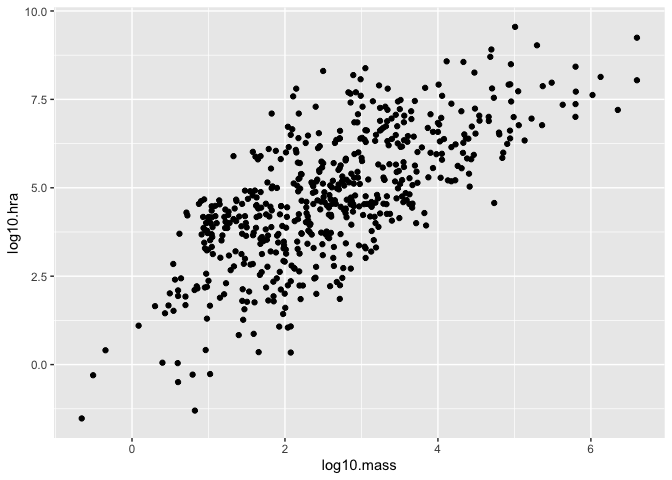<!-- -->

The plot looks clean, but it is incomplete. A reader unfamiliar with the data might have a difficult time interpreting the current labels. To add custom labels, we use the `labs` command.

```r
ggplot(data = homerange, mapping = aes(x = log10.mass, y = log10.hra)) +
  geom_point() +
  labs(title = "Mass vs. Homerange",
       x = "Mass (log10)",
       y = "Homerange (log10)")
```

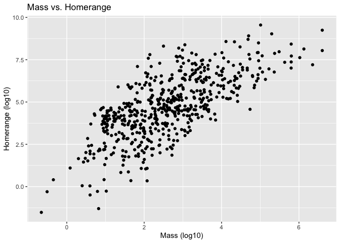<!-- -->

We can improve the plot further by adjusting the size and face of the text. We do this using `theme()`.

```r
ggplot(data = homerange, mapping = aes(x = log10.mass, y = log10.hra)) +
  geom_point() +
  labs(title = "Mass vs. Homerange",
       x = "Mass (log10)",
       y = "Homerange (log10)")+
  theme(plot.title = element_text(size = 18, face = "bold"),
        axis.text = element_text(size = 12),
        axis.title = element_text(size = 12))
```

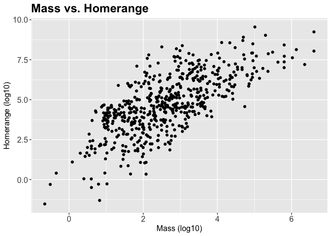<!-- -->

The `rel()` option changes the relative size of the title to keep things consistent. Adding `hjust` allows control of title position.

```r
ggplot(data = homerange, mapping = aes(x = log10.mass, y = log10.hra)) +
  geom_point() +
  labs(title = "Mass vs. Homerange",
       x = "Mass (log10)",
       y = "Homerange (log10)")+ 
  theme(plot.title = element_text(size = rel(1.5), hjust = 0.5))
```

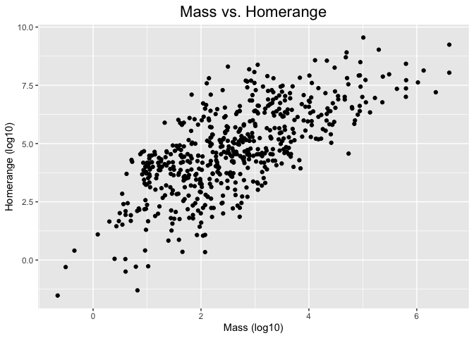<!-- -->

## Practice
1. Make a barplot that shows the number of individuals per locomotion type. Be sure to provide a title and label the axes appropriately.

```r
homerange %>% 
  ggplot(aes(x=locomotion))+
  geom_bar()+
  labs(title = "Locomotion Types",
       y = "Number of Individuals")+
  theme(plot.title = element_text(size = rel(2), hjust = 0.5))
```

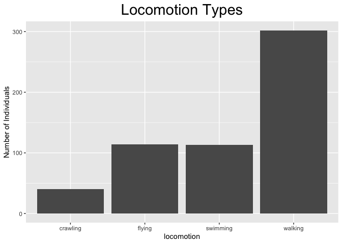<!-- -->


## Other Aesthetics
There are lots of options for aesthtics. An aesthetic can be assigned to either numeric or categorical data. `color` is a common option. Because color is included within the main `ggplot` command, it will color the points based on the category to which they belong and add a key.

```r
homerange %>% 
  ggplot(aes(x = log10.mass, y = log10.hra, color = locomotion)) +
  geom_point()
```

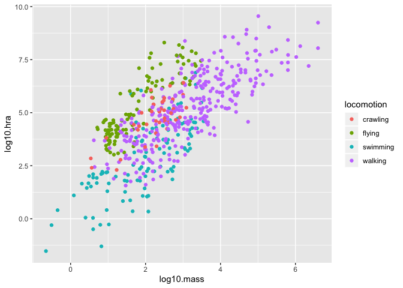<!-- -->

Adding color within `geom_point()` changes the color of all of the points.

```r
homerange %>% 
  ggplot(aes(x = log10.mass, y = log10.hra)) +
  geom_point(color = "orange")
```

<!-- -->

`size` adjusts the size of points relative to a continuous variable.

```r
options(scipen = 999) #disable scientific notation

homerange %>% 
  ggplot(aes(x = log10.mass, y = log10.hra, size = mean.mass.g)) +
  geom_point()
```

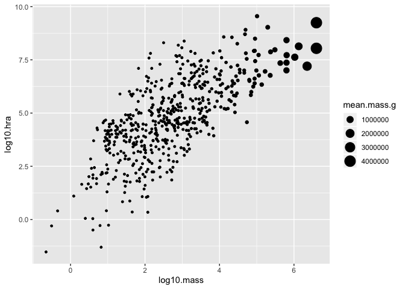<!-- -->

Here I am plotting `class` on the x-axis and `log10.mass` on the y-axis. I use `group` to make individual box plots for each taxon. I also use `fill` so I can associate the different taxa with a color coded key.

```r
homerange %>% 
  ggplot(aes(x = class, y = log10.mass, group = taxon, fill = taxon)) +
  geom_boxplot()
```

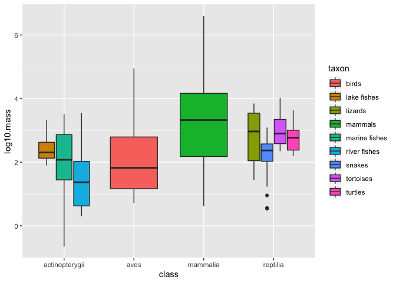<!-- -->

## Practice
1. Make a barplot that shows counts of ectotherms and endotherms. Label the axes, provide a title, and fill by thermoregulation type.

```r
homerange %>% 
  ggplot(aes(x=thermoregulation, fill = thermoregulation))+
  geom_bar()+
  labs(title = "Thermoregulation Types",
       x = "Thermoregulation",
       y = NULL)+
  theme(plot.title = element_text(hjust = 0.5))
```

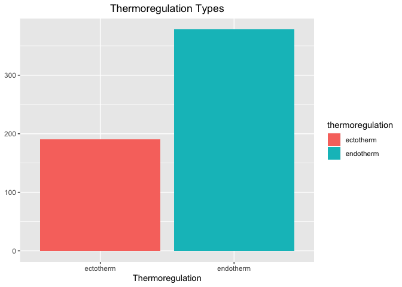<!-- -->


2. Make a boxplot that compares thermoregulation type by log10.mass. Group and fill by class. Label the axes and provide a title.

```r
homerange %>% 
  ggplot(aes(x=thermoregulation, y=log10.mass, group = class, fill = class))+
  geom_boxplot()+
  labs(title = "Masses of Different Thermoregulation Types",
       x = "Mass (log10)",
       y = "Thermoregulation Type")+
  theme(plot.title = element_text(hjust = 0.5))
```

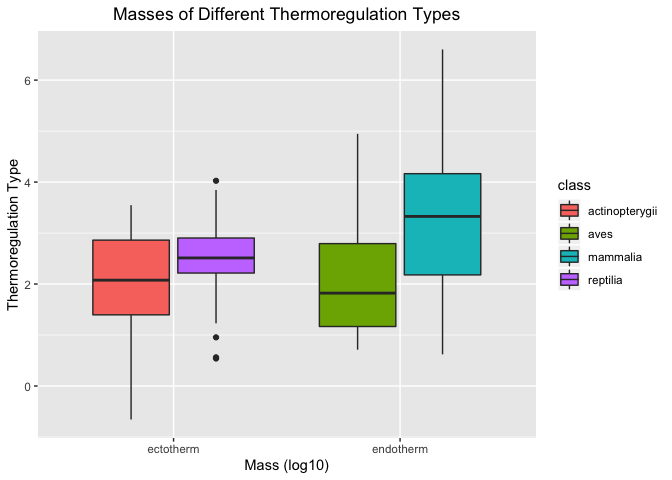<!-- -->


## That's it, let's take a break!   

-->[Home](https://jmledford3115.github.io/datascibiol/)
