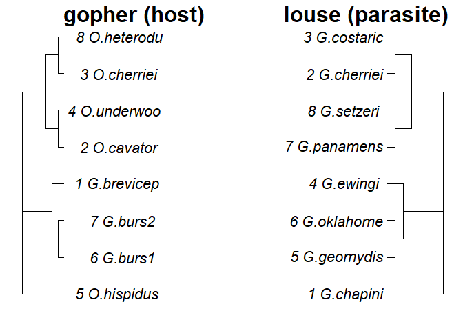
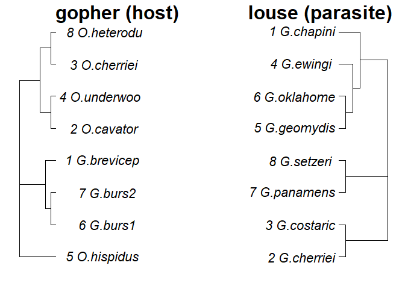

## Libraries  


```r
library("seqinr")
library("ape")
#> 
#> Attaching package: 'ape'
#> The following objects are masked from 'package:seqinr':
#> 
#>     as.alignment, consensus
```

## Learning Goals
*At the end of this exercise, you will be able to:*  
1. Generate some basic summary statistics for a given sequence.
2. Read alignments into R.
3. Run basic analyses to generate trees both in line and using a premade script.

In the previous section we explored the NCBI database, searched for and downloaded sequence data, and wrote that data into a fasta file Using `read.fasta()`. Now we're going to pull a sequence from the NCBI database and analyze it, then we'll use some example data in seqinR to learning how to visualize our sequence data in the form of a phylogenetic tree.

If you've cleared your R environment since we started, pull that Dengue virus sequence again. (The accession number is "NC_001477")


And we'll write it to a .fasta file, and then read the file into R.

```r
write.fasta(names="DEN-1", sequences=dengueseq, file.out="data/den1.fasta")
```


```r
dengue <- read.fasta(file = "data/den1.fasta")
```

But the sequence is still stored as the first item in the R list, so let's pull it out using double square brackets

```r
dengueseq <- dengue[[1]]
```

Now we can look at the sequence and learn couple things about it. For example, we can find out how long our sequence is.

```r
length(dengueseq)
#> [1] 10735
```

We can also create a table of the base composition of our sequence.

```r
table(dengueseq)
#> dengueseq
#>    a    c    g    t 
#> 3426 2240 2770 2299
```

One variable we frequently report on our sequence data in publications is the "GC content" or the fraction of the sequence that is G's and C's.

```r
GC(dengueseq)
#> [1] 0.4666977
```

##Practice
1. Using one of the lizard accession numbers from the first half of class, pull that sequence on it's own from GenBank, store it as a .fasta file, and read it into R. Then pull the sequence out of the R list using double square brackets.

```r
lizseq <- read.GenBank("AY662598", as.character = T)
```

```r
write.fasta(names="LIZ-1", sequences=lizseq, file.out="data/liz1.fasta")
lizard <- read.fasta(file = "data/liz1.fasta")
```

```r
lizseq <- lizard[[1]]
```

2. What is the length of this sequence?

```r
length(lizseq)
#> [1] 2837
```

3. Generate a table showing the nucleotide base composition of your chosen sequence.

```r
table(lizseq)
#> lizseq
#>   a   c   g   t 
#> 901 583 648 705
```

4. What is the GC content of the sequence you've chosen?

```r
GC(lizseq)
#> [1] 0.4339091
```


Next, we are going to look at COI sequence data from gophers and their assocaited chewing lice. We'll start by using the `read.alignment()` function to read in the .fasta alignment files for each group and have a look at them

```r
#COI sequences for 8 species of louse
louse <- read.alignment(system.file("sequences/louse.fasta", package = "seqinr"), format = "fasta")
louse$nam
#> [1] "gi|548117|gb|L32667.1|GYDCYTOXIB" "gi|548119|gb|L32668.1|GYDCYTOXIC"
#> [3] "gi|548121|gb|L32669.1|GYDCYTOXID" "gi|548125|gb|L32671.1|GYDCYTOXIF"
#> [5] "gi|548127|gb|L32672.1|GYDCYTOXIG" "gi|548131|gb|L32675.1|GYDCYTOXII"
#> [7] "gi|548133|gb|L32676.1|GYDCYTOXIJ" "gi|548137|gb|L32678.1|GYDCYTOXIL"
```


```r
#COI sequences for each louse's gopher host
gopher <- read.alignment(system.file("sequences/gopher.fasta", package = "seqinr"), format = "fasta")
gopher$nam
#> [1] "gi|548223|gb|L32683.1|PPGCYTOXIA" "gi|548197|gb|L32686.1|OGOCYTOXIA"
#> [3] "gi|548199|gb|L32687.1|OGOCYTOXIB" "gi|548201|gb|L32691.1|OGOCYTOXIC"
#> [5] "gi|548203|gb|L32692.1|OGOCYTOXID" "gi|548229|gb|L32693.1|PPGCYTOXID"
#> [7] "gi|548231|gb|L32694.1|PPGCYTOXIE" "gi|548205|gb|L32696.1|OGOCYTOXIE"
```

Let's pull the species names out of each dataset and create a vector for each.

**lice**

```r
l.names <- readLines(system.file("sequences/louse.names", package = "seqinr"))
l.names
#> [1] "G.chapini "  "G.cherriei " "G.costaric " "G.ewingi  "  "G.geomydis "
#> [6] "G.oklahome " "G.panamens " "G.setzeri  "
```

**gophers**

```r
g.names <- readLines(system.file("sequences/gopher.names", package = "seqinr"))
g.names
#> [1] "G.brevicep " "O.cavator "  "O.cherriei " "O.underwoo " "O.hispidus "
#> [6] "G.burs1 "    "G.burs2 "    "O.heterodu"
```


We know each of the louse species is associated with it's host. Perhaps it would be cool to create phylogenetic trees of both groups and see if there is congruence between host and parasite evolution. Right? I thought so!

Step 1: Infer the trees! For our purposes we will just use a basic neighbor-joining algorithm under the Juke and Cantor's correction for multiple substitions (don't stress too much about that last word jumble, let's go!)

```r
louse.JC <- dist.dna(as.DNAbin(louse), model = "JC69")
gopher.JC <- dist.dna(as.DNAbin(gopher), model = "JC69")
l <- nj(louse.JC)
g <- nj(gopher.JC)
```

Step 2: Illiustrate the trees! First a little book keeping because we're going to change some of our graphical paramaters and we want to be able to change them back easily.

```r
op <- par(no.readonly = TRUE)
```


Now let's see the tree!

```r
g$tip.label <- paste(1:8, g.names)
l$tip.label <- paste(1:8, l.names)
layout(matrix(data = 1:2, nrow = 1, ncol = 2), width=c(1.4, 1))
par(mar=c(2,1,2,1))
plot(g, adj = 0.8, cex = 1.4, use.edge.length=FALSE,main = "gopher (host)", cex.main = 2)
plot(l,direction="l", use.edge.length=FALSE, cex = 1.4,main = "louse (parasite)", cex.main = 2)
```

<!-- -->
##BOOM. We made a tree. NO. We made two trees!

And then put our graphical parameters back just how we found them

```r
par(op)
```

All right, let's step it up a notch. We may not be super duper programmers, but there are super duper programmers and they write cool scripts we can use. One such script is in your folder for this lab, and it's called "essai.r" This script creates the same tree diagram. The nice thing about using a script is that, similar to a markdown file, it is relatively simple to edit and also to share with others. 

```r
source("essai.r")
```

<!-- -->

## Practice
Oh no! You have presented your gopher-louse tree to your boss who responds, "Oh no! Not Jukes and Cantor! We must use the Kimura's 2-parameters distance model." But you're not bothered, you just open the essai.r script in your text editor and replace model = "JC69" with model = "K80". Edit your script and rerun it to generate your trees under this model of evolution. Are the results different than those generated above?  
